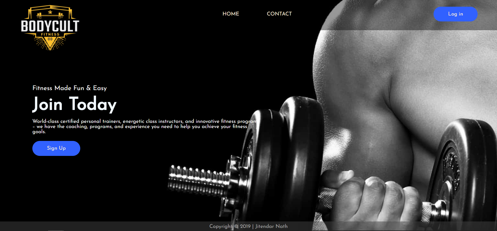

# BodyCult
A web based application built using Django (Python). The application lets a user attend fitness sessions hosted by Gym Trainers.
Implemented DBMS concepts and CRUD operations.

 ## :large_orange_diamond: **Application Live Demo**  
 
  

 
